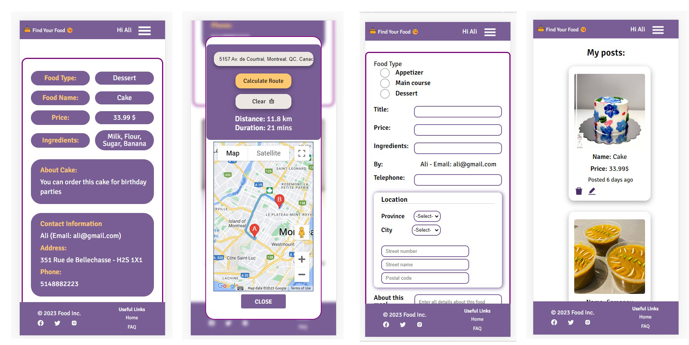
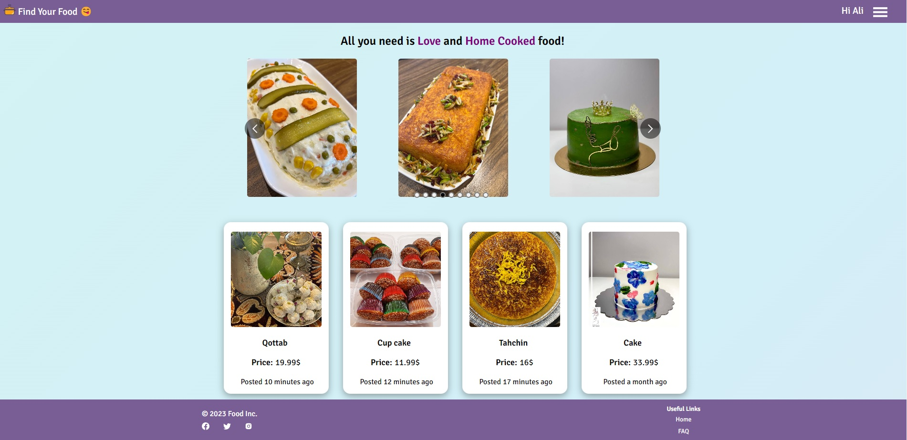
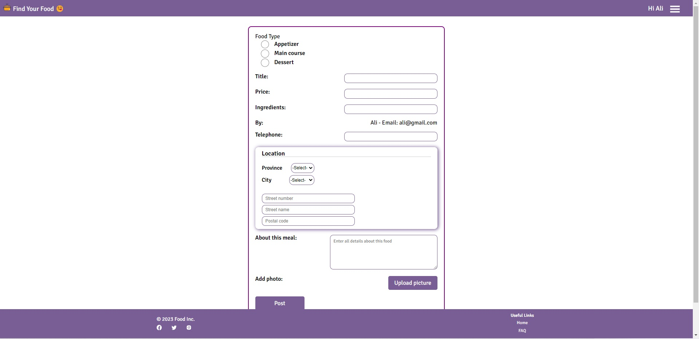
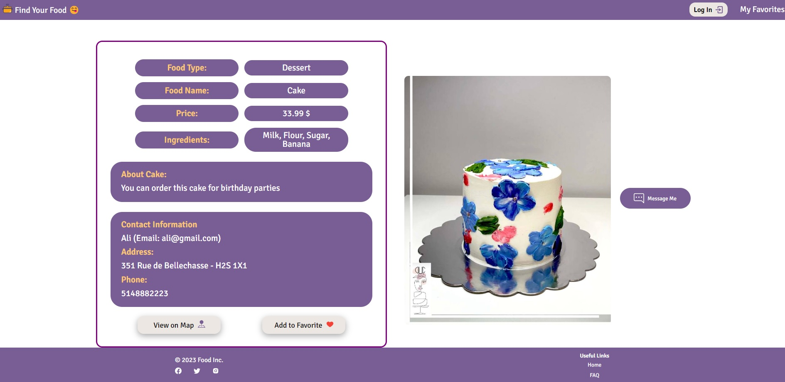
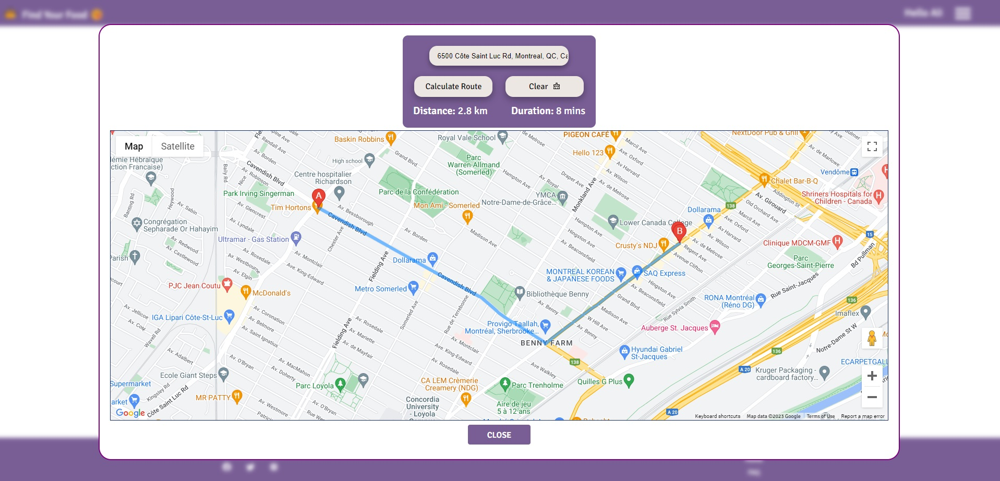
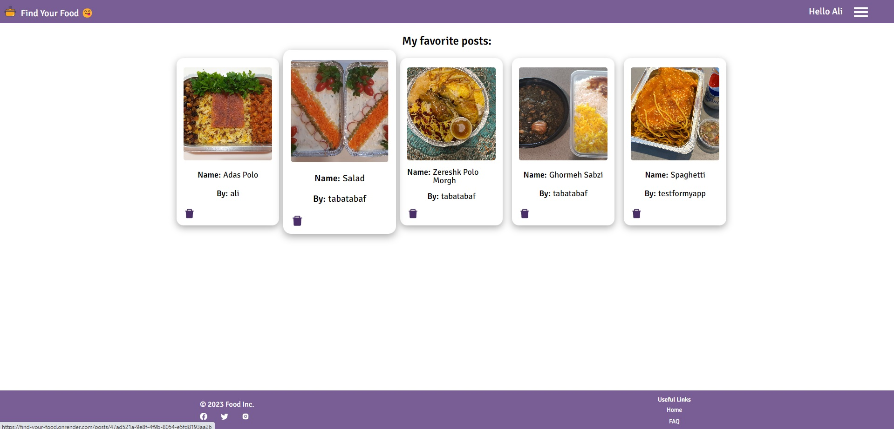
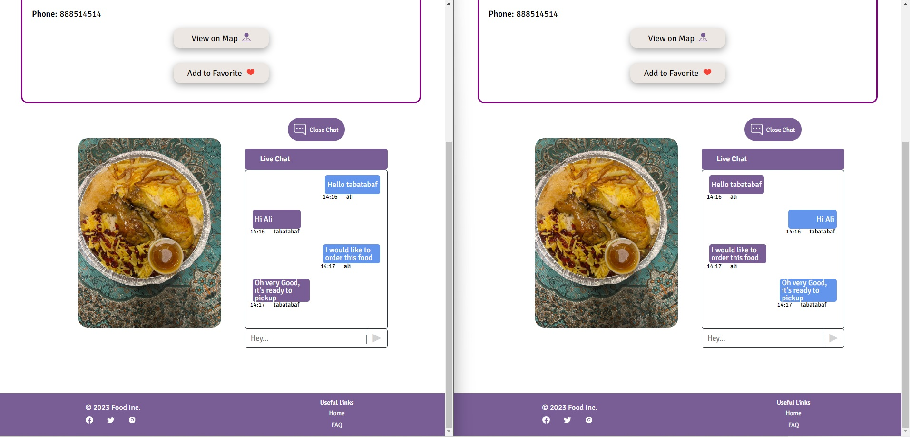
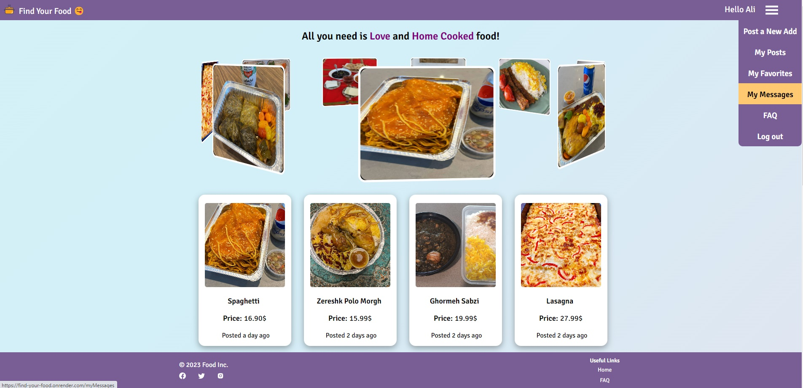

<h1 align="center">😋🍲 Welcome to Find your Food! 🍲😋</h1>

📌 <strong> A Full-stack MERN App </strong>

📌 Makes uses of <strong>HTML </strong>, <strong>CSS </strong>, <strong> ES6 JavaScript</strong>, and <strong> React</strong> on the FE, <strong> NodeJS</strong>, <strong> ExpressJS </strong>, and <strong> MongoDB </strong> on the BE. 

📌 The APIs:  <a href="https://developers.google.com/maps"> <strong>Google Map API </strong> </a>, <a href="https://auth0.com/docs/quickstart/spa/react/interactive"> <strong>Auth0</strong> </a>, <a href="https://cloudinary.com/documentation">  <strong>Cloudinary</strong></a>, and <a href="https://socket.io/"> <strong>Socket.io</strong> </a> 

📌 In this platform, you can surf meals and get connected with the cook. 

📌 User can add a post to favorite list or make a new post and edit/delete it or send a message to cook. 

📌 <a href="https://socket.io/"> Socket.io </a> provides a live chat system. 

📌 <a href="https://developers.google.com/maps"> Google Map API </a> provides location and based on origin address, the duration and distance is calculated. 

📌 <a href="https://cloudinary.com/documentation"> Cloudinary </a> stores the pictures used accross the website as well as a widget to upload picture of the food. 

📌 <a href="https://auth0.com/docs/quickstart/spa/react/interactive"> Auth0 </a> provides a secure and fast log in. 

 Click <a href="https://find-your-food.onrender.com"><strong> Here</strong> </a> to view the deployed website at render.com 

#### On Mobile device

#### Screenshot of Home page

#### Screenshot of Post a new Add

#### Screenshot of View Post Details

#### Screenshot of Showing on Google Map

#### Screenshot of My Favorite Posts

#### Screenshot of Live Chat

#### Screenshot of Menu
