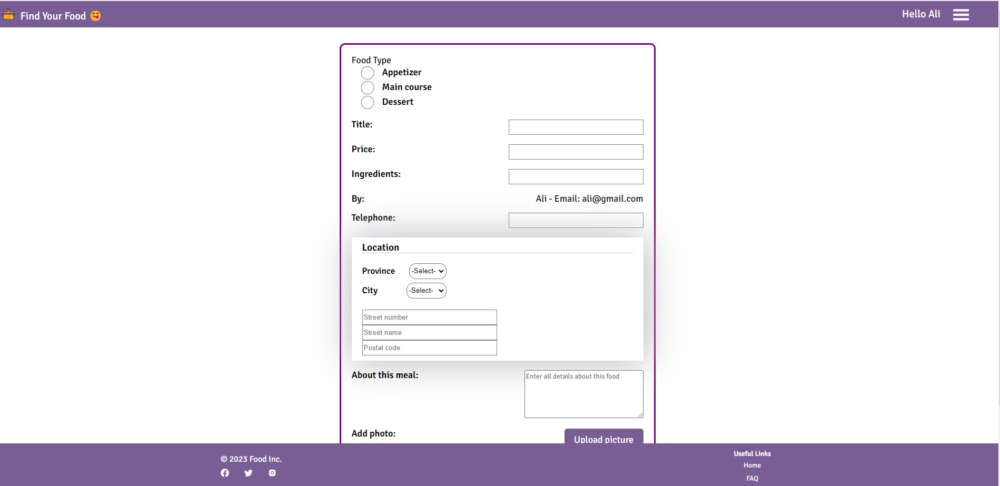
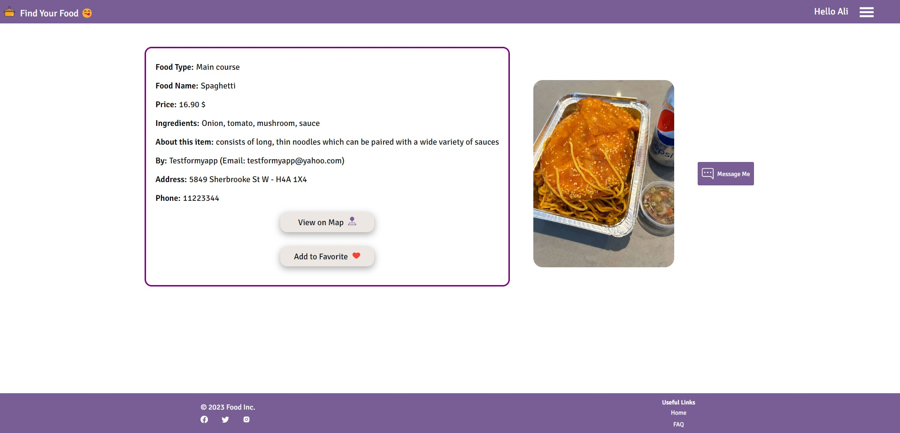

<h1 align="center">😋🍲 Welcome to Find your Food! 🍲😋</h1>

📌 A Full-stack MERN App 

📌 Makes uses of HTML, CSS, ES6 JavasScript and React on the FE, NodeJS, ExpressJS and MongoDB on the BE. 

📌 The APIs:  <a href="https://developers.google.com/maps"> Google Map API </a>, <a href="https://auth0.com/docs/quickstart/spa/react/interactive"> Auth0 </a>, <a href="https://cloudinary.com/documentation"> Cloudinary </a>, and <a href="https://socket.io/"> Socket.io </a> 

📌 In this platform, you can surf meals and get connected with the cook. 

📌 User can add a post to favorite list or make a new post and edit/delete it or send a message to cook. 

📌 <a href="https://socket.io/"> Socket.io </a> provides a live chat system. 

📌 <a href="https://developers.google.com/maps"> Google Map API </a> provides location and based on origin address, the duration and distance is calculated. 

📌 <a href="https://cloudinary.com/documentation"> Cloudinary </a> is used to store the pictures used accross the website as well as a widget to upload picture of the food. 

📌 <a href="https://auth0.com/docs/quickstart/spa/react/interactive"> Auth0 </a> is use to have a secure and fast log in. 

Click [Here](https://find-your-food.onrender.com) to view the deployed website at render.com

#### Screenshot of Home page

#### Screenshot of Post a new Add

#### Screenshot of View Post Details

#### Screenshot of Showing on Google Map

#### Screenshot of My Favorite Posts

#### Screenshot of Live Chat

#### Screenshot of Menu
